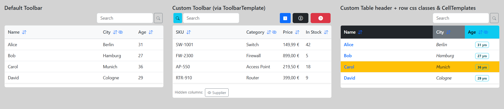

# SoPro.FancyTable



## Overview

`FancyTable` is a reusable Blazor component that provides an interactive table experience with built-in support for searching, sorting, and column visibility management. It's designed to work with any data type through its generic `TItem` parameter.

## Features

### 🔍 Search
- **Default search**: Automatically searches across all columns where `Searchable = true`
- **Custom search predicates**: Define custom search logic via `SearchPredicate`
- **Debounced input**: Search input applies with a `250ms` debounce
- **Immediate search on Enter**: Press `Enter` to apply the current search text immediately
- **Quick actions**: Search/clear button behavior in the default toolbar
- **Flexible search text**: Configure custom search text extraction per column via `SearchTextSelector`

### 📊 Sorting
- **Column sorting**: Click sortable column headers to sort ascending or descending
- **Visual indicators**: Icons show current sort state (`bi-arrow-down-up`, `bi-sort-up`, `bi-sort-down`)
- **Custom sort values**: Define custom sort comparisons per column via `SortValueSelector`
- **Fallback sort value**: Falls back to `ValueSelector` when `SortValueSelector` is not set
- **Toggle direction**: Click the same column header again to reverse sort order

### 👁️ Column Visibility
- **Hide columns**: Eye-slash button on hideable column headers hides columns on demand
- **Show hidden columns**: Dedicated section below the table displays hidden columns with restore buttons
- **Flexible configuration**: Each column can be marked as hideable via `Hideable`

### 🎨 Customization
- **Custom toolbar**: Replace the default search bar via `ToolbarTemplate`
- **Column templates**: Render custom cell content via `CellTemplate`
- **Header and cell styling**: Apply CSS classes via `HeaderClass` and `CellClass`
- **Row styling**: Apply row CSS classes via `RowClassSelector`
- **Search placeholder**: Customize the default search input placeholder via `SearchPlaceholder`

## Parameters

| Parameter | Type | Description |
|-----------|------|-------------|
| `Items` | `IReadOnlyList<TItem>` | The data items to display in the table (required) |
| `Columns` | `IReadOnlyList<FancyColumn<TItem>>` | Column configuration (required) |
| `SearchPlaceholder` | `string` | Placeholder text for the default search input (default: `"Search"`) |
| `ToolbarTemplate` | `RenderFragment?` | Custom toolbar content; replaces the default search bar |
| `SearchPredicate` | `Func<TItem, string, bool>?` | Custom search logic; overrides default column-based search |
| `RowClassSelector` | `Func<TItem, string?>?` | Returns CSS class(es) for each row |

## Column Configuration

Each column is configured using `FancyColumn<TItem>`:

| Property | Type | Description |
|----------|------|-------------|
| `Key` | `string` | Unique identifier for the column |
| `Title` | `string` | Display name shown in the header |
| `Sortable` | `bool` | Whether the column can be sorted |
| `Searchable` | `bool` | Whether the column is included in search (default: `true`) |
| `Hideable` | `bool` | Whether the column can be hidden by the user |
| `HeaderClass` | `string?` | CSS class applied to the header cell |
| `CellClass` | `string?` | CSS class applied to data cells |
| `ValueSelector` | `Func<TItem, object?>?` | Extracts the value to display for each row |
| `SortValueSelector` | `Func<TItem, IComparable?>?` | Extracts the value used for sorting (falls back to `ValueSelector`) |
| `SearchTextSelector` | `Func<TItem, string?>?` | Extracts the text used for searching (falls back to `ValueSelector?.ToString()`) |
| `CellTemplate` | `RenderFragment<TItem>?` | Custom Blazor template to render cell content |

## Setup

To use SoPro.FancyTable in your Blazor application, include Bootstrap CSS and Bootstrap Icons in your app (`App.razor` / host page):

```html
<link rel="stylesheet" href="https://cdn.jsdelivr.net/npm/bootstrap@5.3.7/dist/css/bootstrap.min.css" />
<link rel="stylesheet" href="https://cdn.jsdelivr.net/npm/bootstrap-icons@1.11.3/font/bootstrap-icons.min.css" />
```

## Usage Example

This example covers:
- default toolbar
- custom toolbar (`ToolbarTemplate`)
- custom header/cell classes
- custom cell template
- row-level classes (`RowClassSelector`)

```csharp
@page "/fancy-table-demo"

<div class="d-flex">
    <div class="p-3 col">
        <h5>Default Toolbar</h5>
        <FancyTable TItem="PersonRow"
                    Items="PeopleRows"
                    Columns="PeopleColumns"
                    SearchPlaceholder="Search name or city..." />
    </div>

    <div class="p-3 col">
        <h5>Custom Toolbar (via ToolbarTemplate)</h5>
        <FancyTable TItem="ProductRow"
                    Items="ProductRows"
                    Columns="ProductColumns">
            <ToolbarTemplate>
                <div class="d-flex">
                    <button class="btn btn-sm btn-info mx-1">
                        <i class="bi bi-search"></i>
                    </button>
                    <input class="form-control form-control-md" placeholder="Custom search UI" />
                </div>
            </ToolbarTemplate>
        </FancyTable>
    </div>

    <div class="p-3 col">
        <h5>Custom Table header + row css classes & CellTemplates</h5>
        <FancyTable TItem="PersonRow"
                    Items="PeopleRows"
                    Columns="StyledPeopleColumns"
                    RowClassSelector="GetPersonRowClass" />
    </div>
</div>

@code {
    private IReadOnlyList<PersonRow> PeopleRows =
    [
        new("Alice", "Berlin", 31),
        new("Bob", "Hamburg", 27),
        new("Carol", "Munich", 36),
        new("David", "Cologne", 29)
    ];

    private IReadOnlyList<FancyColumn<PersonRow>> PeopleColumns =>
    [
        new FancyColumn<PersonRow>
        {
            Key = "name",
            Title = "Name",
            Sortable = true,
            Searchable = true,
            ValueSelector = person => person.Name,
            SortValueSelector = person => person.Name
        },
        new FancyColumn<PersonRow>
        {
            Key = "city",
            Title = "City",
            Sortable = true,
            Searchable = true,
            Hideable = true,
            ValueSelector = person => person.City,
            SortValueSelector = person => person.City
        },
        new FancyColumn<PersonRow>
        {
            Key = "age",
            Title = "Age",
            Sortable = true,
            Searchable = false,
            ValueSelector = person => person.Age,
            SortValueSelector = person => person.Age
        }
    ];

    private IReadOnlyList<ProductRow> ProductRows =
    [
        new("SW-1001", "Switch", 149.99m, 42, "NetWare Ltd"),
        new("FW-2300", "Firewall", 899.00m, 5, "SecureCore AG"),
        new("AP-550", "Access Point", 219.50m, 18, "WaveLink"),
        new("RTR-910", "Router", 399.00m, 9, "RouteStack Inc")
    ];

    private IReadOnlyList<FancyColumn<ProductRow>> ProductColumns =>
    [
        new FancyColumn<ProductRow>
        {
            Key = "sku",
            Title = "SKU",
            Sortable = true,
            Searchable = true,
            ValueSelector = product => product.Sku,
            SortValueSelector = product => product.Sku,
        },
        new FancyColumn<ProductRow>
        {
            Key = "category",
            Title = "Category",
            Sortable = true,
            Searchable = true,
            Hideable = true,
            ValueSelector = product => product.Category,
            SortValueSelector = product => product.Category
        },
        new FancyColumn<ProductRow>
        {
            Key = "price",
            Title = "Price",
            Sortable = true,
            Searchable = false,
            ValueSelector = product => product.Price.ToString("C2"),
            SortValueSelector = product => product.Price
        },
        new FancyColumn<ProductRow>
        {
            Key = "stock",
            Title = "In Stock",
            Sortable = true,
            Searchable = false,
            ValueSelector = product => product.Stock,
            SortValueSelector = product => product.Stock
        },
        new FancyColumn<ProductRow>
        {
            Key = "supplier",
            Title = "Supplier",
            Sortable = true,
            Searchable = true,
            Hideable = true,
            ValueSelector = product => product.Supplier,
            SortValueSelector = product => product.Supplier
        }
    ];

    private IReadOnlyList<FancyColumn<PersonRow>> StyledPeopleColumns =>
    [
        new FancyColumn<PersonRow>
        {
            Key = "styled-name",
            Title = "Name",
            Sortable = true,
            Searchable = true,
            HeaderClass = "text-bg-dark",
            CellClass = "fw-semibold text-primary",
            ValueSelector = person => person.Name,
            SortValueSelector = person => person.Name
        },
        new FancyColumn<PersonRow>
        {
            Key = "styled-city",
            Title = "City",
            Sortable = true,
            Searchable = true,
            HeaderClass = "text-bg-secondary",
            CellClass = "fst-italic",
            ValueSelector = person => person.City,
            SortValueSelector = person => person.City
        },
        new FancyColumn<PersonRow>
        {
            Key = "styled-age",
            Title = "Age",
            Sortable = true,
            Searchable = false,
            Hideable = true,
            HeaderClass = "text-bg-info",
            CellClass = "text-center",
            SortValueSelector = person => person.Age,
            CellTemplate = person => @<span class="badge text-bg-info-subtle border border-info text-info-emphasis">@person.Age yrs</span>
        }
    ];

    private string? GetPersonRowClass(PersonRow person) => person.Age >= 35 ? "bg-warning" : null;

    private sealed record PersonRow(string Name, string City, int Age);
    private sealed record ProductRow(string Sku, string Category, decimal Price, int Stock, string Supplier);
}
```

## Component Dependencies

- **Bootstrap 5**: For styling and grid utilities (MIT License)
- **Bootstrap Icons**: For UI icons (search, sort, eye, etc.) (MIT License)

## License

This project is licensed under the **MIT License**.

Bootstrap and Bootstrap Icons are also licensed under the MIT License.
